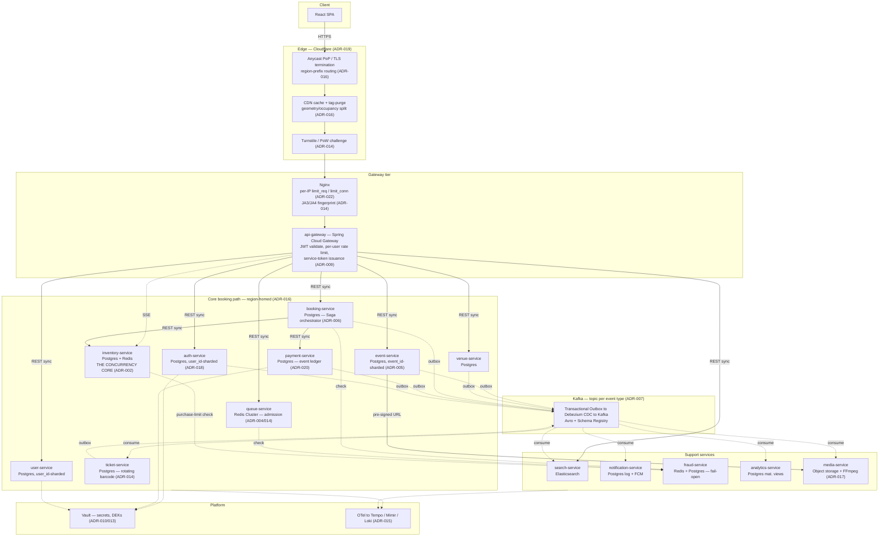
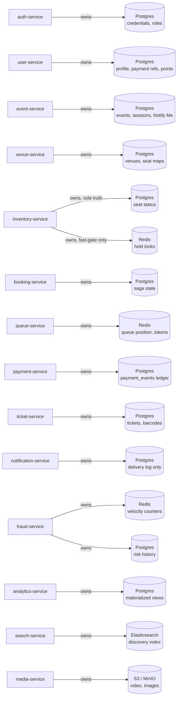
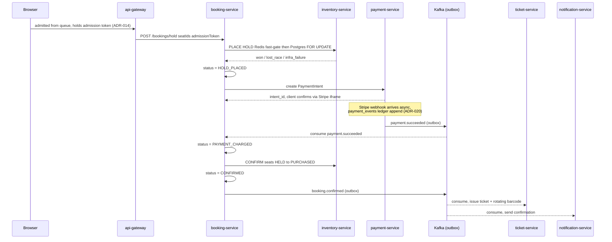
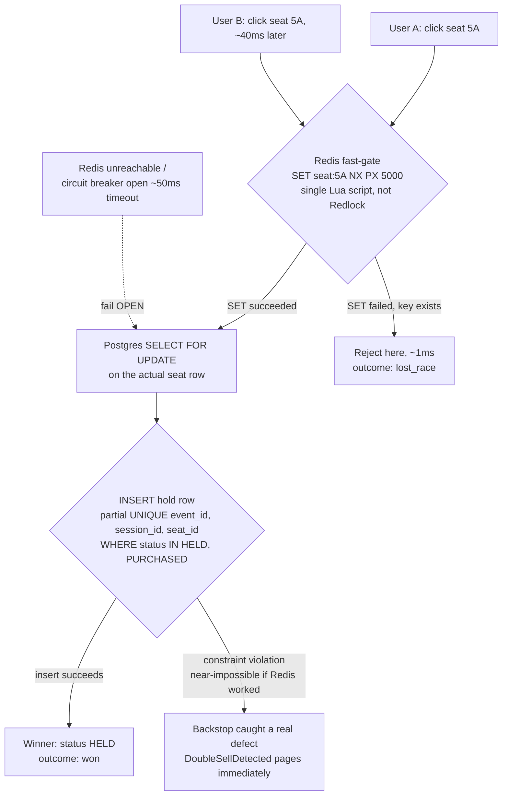
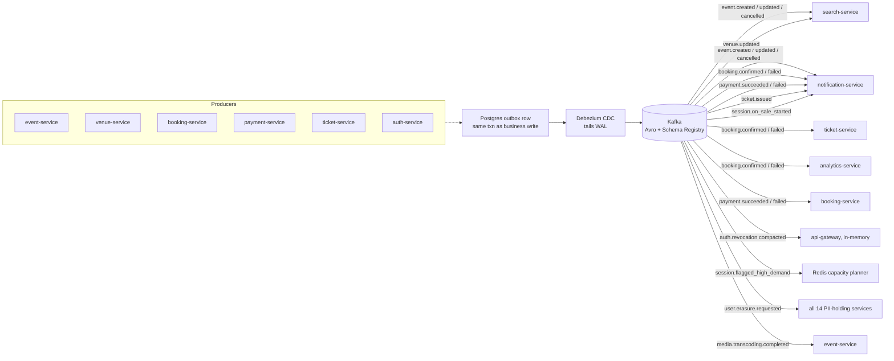
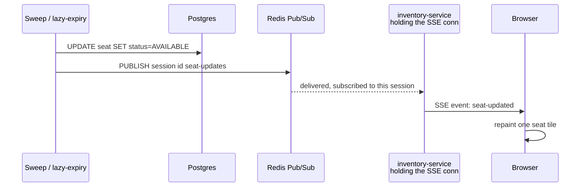
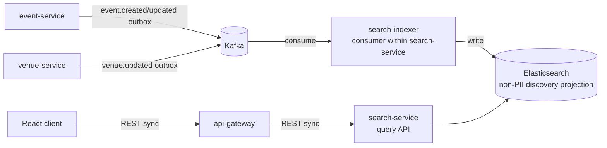

Status: reconstructed from ADR-001 through ADR-022 and all project pages.
Nothing here is a new decision — this page traces every component back to
an accepted ADR or existing project doc. Where a decision was reversed,
both states are shown. Where nothing was decided, it's marked `TBD`, not
guessed. See `## Open Questions` at the bottom for the live list.

**Staleness notice (2026-08-13)**: this reconstruction stops at ADR-022.
ADR-023 through ADR-035 are NOT reflected below — most materially,
§1/§2's internal service-to-service calls are still described as REST
(superseded by [[ADR-023-grpc-internal-service-calls]]'s move to gRPC),
and no PgBouncer layer ([[ADR-024-pgbouncer-connection-pooling]]) appears
in front of Citus. Per `second-brain/CLAUDE.md`'s source-authority order,
the individual ADRs (023-035) are current truth; treat every section
below as accurate only through ADR-022 until this page is regenerated.
Not fixed in place here — regenerating a 13-section reconstruction
correctly requires re-deriving each affected diagram/table, deliberately
scoped out of this pass to avoid a partial, silently-wrong rewrite.

# 1. Final System Architecture

Two vendors split the stack at the edge boundary
([[ADR-019-cdn-vendor-choice]]): Cloudflare owns everything a request
touches before it reaches a service; AWS owns everything behind that.
Fifteen backend services, each independently justified against
[[ADR-001-microservices-vs-modular-monolith]]'s "must earn its own
existence" bar.



Solid arrows = synchronous REST/SSE on the request path. Dashed arrows =
async (Kafka event, or a fire-and-forget check). The core booking path is
region-homed as a unit ([[ADR-016-multi-region-cdn]]) — a request never
crosses regions mid-transaction.

**Reading this diagram:** nothing calls a database that isn't its own.
`inventory-service` is the box every other decision in this system exists
to protect — see Section 5.

# 2. Service Responsibility Map

| Service | Responsibility | Owns data | Key dependencies |
|---|---|---|---|
| `api-gateway` | Edge routing, JWT validation, per-user rate limiting, circuit breaking to downstream | none (stateless; Redis for rate buckets) | Spring Cloud Gateway behind Nginx; auth-service JWKS; Resilience4j |
| `auth-service` | Registration, login, JWT issuance/refresh, role management | Postgres (`user_id`-sharded, ADR-018) | Vault (AppRole); publishes `auth.revocation` |
| `user-service` | Profile, saved-payment-method references, preferences, points ledger | Postgres (`user_id`-sharded) | payment-service (via reference only, ADR-011) |
| `event-service` | Events, sessions/shows, artist data, Notify Me signups, high-demand flag | Postgres (`event_id`-sharded, ADR-005) | venue-service (capacity read); emits `event.*` |
| `venue-service` | Venues, seating layout (sections/rows/seats) | Postgres | read by inventory-service |
| `search-service` | Discovery/browse — read-optimized projection, non-PII only | Elasticsearch **or OpenSearch — TBD** | consumes `event.*`/`venue.*` via Kafka |
| `inventory-service` | Seat state machine — the concurrency core (ADR-002) | Postgres (truth) + Redis (fast-gate) | venue-service; fraud-service (purchase limits) |
| `booking-service` | Saga orchestration: hold → charge → confirm → compensate (ADR-006) | Postgres (saga state) | inventory-service, payment-service, fraud-service; emits `booking.*` |
| `queue-service` | Virtual waiting room, randomized admission (ADR-014) | Redis Cluster | fraud-service; fails *closed* on-sale path |
| `payment-service` | Payment intents, webhook processing, idempotency, refunds (ADR-020) | Postgres — append-only `payment_events` | Stripe (SAQ A iframe, ADR-011); Vault |
| `ticket-service` | Ticket issuance, rotating barcode, transfer, price-capped resale | Postgres | consumes `booking.confirmed` |
| `notification-service` | Email/SMS/push — transactional + mass on-sale broadcast (ADR-021) | Postgres (delivery log only) | FCM (incl. web push topics) |
| `fraud-service` | Risk scoring, velocity checks, bot detection — advisory, fails open | Redis (velocity) + Postgres (history) | called by queue-service, booking-service, inventory-service |
| `analytics-service` | Organizer dashboards, sell-through reporting | Postgres materialized views | consumes Kafka streams from booking/payment/ticket/event |
| `media-service` | Trailer upload, async FFmpeg transcoding (ADR-017, 15th service) | S3/MinIO + Postgres metadata (in event-service) | FFmpeg; Kafka job topic |
| `frontend` | React/TS client — browsing, seat map, checkout, waiting room, tickets | — | all calls via api-gateway; SSE to inventory-service |
| `infra` | Docker Compose (local), CI/CD, Nginx edge config | — | eventual AWS deployment target (ADR-019) |

Service count evolved 12 (ADR-001) → 14 (+fraud, +analytics — ADR-003) →
15 (+media-service — ADR-017). Every addition was justified in its own
ADR against ADR-001's independent-existence bar — none added by default.

# 3. Data Ownership

Hard rule, stated in [[system-overview]]: **no service reads another
service's database directly.** No shared database exists anywhere in this
design. Cross-service reads happen over REST, or via the Kafka stream —
never a JOIN across a service boundary.



Every arrow is "owns" — never "shares." Redis in this system is never the
source of truth for anything (ADR-002); Postgres or object storage always
is, per service.

## Residency data classes (ADR-013, ADR-016, ADR-018)

Applied uniformly to every service holding personal or event data — not a
per-service ad hoc rule:

| Class | Examples | Rule |
|---|---|---|
| **G** — Global | event metadata, venue geometry, price tiers | No residency limit, replicate/CDN freely |
| **S** — Operational, non-personal | `seat.status`, `held_until`, hold token | No legal residency limit, but single-writer only (ADR-002 correctness rule, not GDPR) |
| **R** — Residency-bound | credentials, profile PII, payment-method refs, booking→user_id, ticket ownership | Home region only, never replicated; PII fields DEK-encrypted (ADR-013) |

## Sharding — two distribution keys, one physical Citus cluster per region

- `event_id`-keyed tables (inventory, bookings, tickets, events, venues) —
  sharded per [[ADR-005-postgres-sharding]], 1024 shards/region.
- `user_id`-keyed tables (auth, user profile, refresh tokens,
  saved-payment refs, points) — sharded per
  [[ADR-018-user-identity-sharding-residency]], **reusing the same
  regional Citus clusters**, different distribution column — not a second
  sharding system.
- Region resolved from an ID prefix baked in at creation
  (`evt_eu1_...`, `usr_eu1_...`) — parsed at the edge, never looked up on
  the hot path.

# 4. Booking Flow — Happy Path

Orchestrated Saga ([[ADR-006-saga-booking-orchestration]]),
`booking-service` as coordinator. Each step has a named compensation;
ticket issuance is deliberately *not* in the compensation chain — it's a
non-blocking side effect of confirmation, not a step that can fail the
booking.



Solid arrow = synchronous call on the critical path. The payment webhook
is the actual source of truth (not the synchronous PaymentIntent
response) — booking-service suspends and resumes on the async
`payment.succeeded` event, tracked via a stored `saga_traceparent` for
cross-boundary tracing.

## Saga state machine

```
PENDING -> HOLD_PLACED -> PAYMENT_CHARGED -> CONFIRMED
             |                |
             +---- failure ---+--> COMPENSATING -> FAILED (or resolved)
```

`PaidUserUnresolved` — the named P1 page
([[ADR-015-observability-stack]]): a booking stuck `COMPENSATING`,
unrefunded, past 40 minutes. This is ADR-006's originally-promised
"human escalation," made concrete.

# 5. Double-Booking Prevention — Concurrent Buyers

Two users racing the same seat. This is the single mechanism the rest of
the system is built to protect ([[ADR-002-seat-locking-strategy]],
amended by [[ADR-004-redis-cluster-sharding]]'s Cluster migration). Two
layers, one authority:



Redis is the fast, cheap admission gate — most contention resolves here
in ~1ms, never touching Postgres. Postgres's row lock plus the partial
unique index is the actual correctness authority: Redis can be wrong,
slow, or down entirely and a seat still cannot sell twice.

## Why two layers, not one

- **Redis alone is not enough** — even without Redlock's clock-skew
  problems, a single-instance lock has no durable authority; it's a
  speed optimization, never trusted for correctness.
- **Postgres alone would work** for correctness, but every hold attempt
  would hit the database directly — the fast-gate exists purely to keep
  row-lock contention off Postgres during an on-sale spike.
- **The unique index is the real backstop.** It must include `event_id`
  in its column list (amendment) — Citus enforces uniqueness only
  *within a shard*, so a constraint missing the shard key silently stops
  being a global guarantee once sharded.
- **Redis failure mode is fail-open, deliberately** — with a ~50ms
  command timeout and a Resilience4j circuit breaker (the original "just
  fail open" plan was flagged unimplementable against a fully
  blackholed Redis without a timeout). Losing Redis loses speed, never
  correctness.

## Instrumentation — three outcomes, not two

A binary success/fail metric makes a *successful* on-sale (heavy,
expected `lost_race` volume) look identical to an outage. Every hold
attempt reports one of:

| Outcome | Meaning | Expected during on-sale? |
|---|---|---|
| `won` | This request got the seat | Yes |
| `lost_race` | Someone else got there first — system working correctly | Yes, heavily |
| `infra_failure` | Redis/Postgres error, not contention | No — the only one that pages |

# 6. Event-Driven Architecture

One Kafka topic per event type, partitioned by aggregate ID
([[ADR-007-kafka-event-schema]]). Delivery reliability comes from the
Transactional Outbox pattern — a service never calls Kafka directly
inside its request path; it writes an outbox row in the same DB
transaction as its business write, and Debezium tails the WAL to publish
it. Avro + Confluent Schema Registry enforce schema on every topic; every
consumer topic has a paired `.dlq`.



Every arrow into Kafka is the same outbox mechanism — no service
publishes a second, ad hoc way. `auth.revocation` is log-compacted
specifically so a restarting api-gateway can replay the full current
revocation set from topic start, not just new events.

## Named topics found across the ADRs

| Topic | Key | Producer |
|---|---|---|
| `event.created / updated / cancelled` | `event_id` | event-service |
| `venue.updated` | `venue_id` | venue-service |
| `booking.confirmed / failed` | `booking_id` | booking-service |
| `payment.succeeded / failed` | `payment_intent_id` | payment-service |
| `ticket.issued` | `ticket_id` | ticket-service |
| `auth.revocation` | —, compacted | auth-service |
| `session.on_sale_started` | `session_id` | event-service |
| `session.flagged_high_demand` | `session_id` | event-service |
| `user.erasure.requested / completed / finalized` | `subject_id` | user-service / consuming services |
| `media.transcoding.completed / failed` | `asset_id` | media-service |
| `AdminActionPerformed` | varies | every service, on privileged action |

Envelope fields, every event (ADR-007 + amendment): `eventId, eventType,
version, occurredAt, correlationId, aggregateId, payload, subjectId,
encryptionKeyId`. PII payload fields are Avro `bytes` from schema v1 — a
blocking constraint, since Avro's compatibility rules reject a later
`string→bytes` change once a topic is live (this is what makes
crypto-shredding, ADR-013, retrofittable-proof).

# 7. Real-Time Architecture — Live Seat Map

The only fully-written flow doc in the vault
([[seat-availability-live-updates]]). SSE, not WebSocket —
one-directional server→client push is all this needs.



DB commit always happens before publish — the publish is a side-effect
of an already-committed fact, never the other way. A dropped publish (no
subscriber, network blip) costs a stale tile, never a correctness bug;
Postgres is still truth.

## Connection admission control (ADR-022)

Request-rate limiting doesn't bound *concurrently open* SSE connections —
a client under the rate limit can still hold thousands of streams open.
Four layers, each protecting a different resource:

| Layer | Mechanism | Bounds |
|---|---|---|
| Per-user | api-gateway Redis token bucket, extended to the connect endpoint | connection-open rate |
| Per-IP/device | Nginx `limit_conn` (concurrent, distinct from request-rate) | concurrent connections per IP |
| Per-instance | local in-memory counter, reject with 503 past cap | fds/memory — fails *closed* at capacity, deliberately |
| Global | no synchronous gate — feeds Prometheus/Mimir autoscale signal (ADR-004) | aggregate capacity, via elasticity |

# 8. Search Architecture

Search-service holds a denormalized, read-optimized, eventually-consistent
projection — never the source of truth for anything. It also
deliberately holds **no user PII** (ADR-013's crypto-shredding posture is
easiest here specifically because there's nothing to shred).



Search never reads event-service's Postgres directly — it consumes the
same outbox stream every other consumer does, indexes asynchronously, and
answers reads from its own store. A brand-new event is search-visible on
a lag, not instantly.

> **TBD — Elasticsearch vs. OpenSearch.** The service's own project page
> states this literally undecided ("Elasticsearch (or OpenSearch —
> undecided)"). Not resolved by any ADR. Everything else about the flow —
> projection shape, Kafka consumption, non-PII posture — is decided
> regardless of which engine wins.

# 9. External Dependencies

| Vendor / product | Used for | ADR |
|---|---|---|
| Stripe | Payment provider — iframe-isolated card collection (SAQ A), never touches PAN | 011 |
| HashiCorp Vault | AppRole service auth, dynamic Postgres creds, KV v2 static secrets, Transit engine for GDPR DEKs | 010, 013 |
| Debezium / Kafka Connect | CDC — tails Postgres WAL, publishes committed outbox rows | 007, 010 |
| Confluent Schema Registry | Avro schema enforcement across every Kafka topic | 007 |
| Cloudflare | Anycast edge, CDN, cache-tag purge, Turnstile bot challenge, edge Workers | 019 |
| AWS | Compute (EKS/EC2), managed Postgres/Citus, Redis Cluster, Kafka, object storage — behind Cloudflare's edge | 019, infra.md |
| Firebase Cloud Messaging | Push notifications, incl. web push via FCM-for-Web topic fan-out | 021 |
| Grafana Tempo / Mimir / Loki | Traces / metrics (Prometheus agent mode) / logs — explicitly not the search Elasticsearch cluster | 015 |
| OpenTelemetry | Distributed tracing instrumentation, incl. across the outbox async boundary | 006, 007, 015 |
| k6 | Load testing, 11-experiment calibration map (E1–E11) | 008 |
| Toxiproxy / Chaos Mesh | Deterministic network-level chaos / pod-kill & partition chaos | 008 |
| S3 / MinIO | Object storage — video trailers, event images, ticket PDFs | 017 |
| FFmpeg | Self-hosted video transcoding, multi-rendition HLS | 017 |
| HIBP | Breached-password check at signup, k-anonymity API | 014 |

# 10. Technology Stack

| Layer | Technology | Why (source ADR) |
|---|---|---|
| Edge | Cloudflare + Nginx | Cache-tag purge is load-bearing for ADR-016's invalidation design; CloudFront's path-only purge would need a workaround (019) |
| Gateway | Spring Cloud Gateway | Java-ecosystem consistency with the rest of the stack; Redis-backed per-user token bucket (api-gateway.md) |
| Service auth | Signed internal JWT (client-credentials) | mTLS deferred until k8s migration makes it cheap; layered on a network-policy floor either way (009) |
| Primary DB | PostgreSQL + Citus | Row-level locking is the correctness authority for seat holds; Citus reuses one cluster for two shard keys — event_id, user_id (002, 005, 018) |
| DB HA | Patroni + etcd | Raft-based leader election; deliberately *not* stretched cross-region — human-gated promotion instead (005, 016) |
| Cache / locks | Redis Cluster | Fast, non-authoritative admission gate; hash-tagged sharding; never the source of truth (002, 004) |
| Messaging | Kafka + Debezium + Avro | Transactional Outbox needs a CDC tail, not app-side dual writes; schema enforcement blocks the PII string→bytes trap (007) |
| Search | Elasticsearch **or OpenSearch** | Denormalized non-PII discovery projection — engine choice explicitly open |
| Secrets | HashiCorp Vault | Dynamic DB creds, Transit engine reused for GDPR DEKs instead of a bespoke KMS (010, 013) |
| Payments | Stripe (provider-hosted iframe) | Collapses PCI scope to SAQ A — the cheapest real compliance tier (011) |
| Observability | OTel + Tempo/Mimir/Loki | Object-storage-backed traces make 100% retention of failed sagas affordable; Loki kept off the search ES cluster on purpose (015) |
| Object storage | S3 / MinIO | First real object-storage need in the stack — video forced the gap to get fixed (017) |
| Testing | JUnit + Testcontainers + Spring Cloud Contract + k6 + Toxiproxy/Chaos Mesh | Full pyramid L1–L4 plus dedicated concurrency-proof and chaos harnesses (008) |
| Frontend | React + TypeScript + Vite | frontend.md |

# 11. ADR → Architecture Traceability

| ADR | Decision | Component affected |
|---|---|---|
| 001 | Microservices over modular monolith; 12-service initial breakdown | Overall topology |
| 002 | Redis fast-gate + Postgres `FOR UPDATE` + partial unique index backstop; 5-min flat hold TTL | inventory-service, §5 |
| 003 | Added fraud-service, analytics-service; folded/deferred rest of the gap list | Service map, §2 |
| 004 | Redis Cluster, hash-tagged sharded pub/sub; proactive + reactive autoscale | inventory-service, queue-service, §5, §7 |
| 005 | Postgres/Citus sharded by `event_id`+region; Patroni/etcd coordinator HA | §3 sharding, §10 |
| 006 | Orchestrated Saga in booking-service; compensation chain; `PaidUserUnresolved` alert | booking-service, §4 |
| 007 | Topic-per-event-type, Transactional Outbox + Debezium, Avro schema, PII-as-bytes | §6, all producers |
| 008 | Test pyramid, Spring Cloud Contract, k6, Toxiproxy/Chaos Mesh | §10 |
| 009 | Internal JWT (client-credentials) + user-assertion two-token model | api-gateway, §10 |
| 010 | Vault: AppRole, dynamic Postgres creds, KV v2, Transit engine | auth-service, payment-service, §9 |
| 011 | Stripe iframe collection, SAQ A; payment-service sole token holder | payment-service, user-service, §9 |
| 012 | 10-min access / 30-day rotating refresh; compacted-topic revocation (fail-closed) | auth-service, api-gateway, §6 |
| 013 | Per-subject DEK crypto-shredding; erasure saga across 14 services | §3 data classes, §6 erasure topics |
| 014 | 9 structural anti-bot layers; single-use admission tokens; rotating barcode | queue-service, ticket-service, §1, §5 |
| 015 | OTel + Tempo/Mimir/Loki; domain SLIs; cardinality tiering | §9, §10 |
| 016 | Event-homed routing; honest regional-failover limits; CDN geometry/occupancy split | §1 edge, §3 data classes |
| 017 | Object storage; pre-signed uploads; async FFmpeg via Kafka; media-service (15th) | media-service, §2, §9 |
| 018 | auth/user-service reuse ADR-005's Citus clusters, `user_id` distribution | §3 sharding |
| 019 | Cloudflare for edge/CDN, AWS for compute — layer split | §1, §10 |
| 020 | Append-only `payment_events` ledger; transition-graph-derived status | payment-service, §4 |
| 021 | Notify Me signups; FCM topic fan-out broadcast; feeds ADR-004's demand flag | event-service, notification-service, §6 |
| 022 | 4-layer SSE connection admission control (per-user/IP/instance/autoscale) | inventory-service, §7 |

# 12. Superseded Decisions

Nothing in this vault carries a formal `Status: Superseded by ADR-NNN`
marker on the whole ADR — every ADR-001 through 022 is `Status:
Accepted`. But several specific recommendations inside otherwise-accepted
ADRs were later reversed. Shown old → new, both stated so neither
silently wins.

- **Redis topology** — ADR-002: single-instance Redis, Sentinel noted as
  the HA path → ADR-004: Redis **Cluster**, hash-tagged sharding.
  Sentinel note fully replaced, not layered.
- **Unique constraint columns** — ADR-002 original:
  `UNIQUE(session_id, seat_id)` → Amended: must include `event_id` —
  Citus enforces uniqueness per-shard only; without it the double-sell
  backstop wasn't actually global.
- **Redis fail-open mechanics** — Original: "just fail open on Redis
  error" → Amended: flagged unimplementable against a fully blackholed
  connection — added explicit ~50ms timeout + Resilience4j circuit
  breaker.
- **Cluster rebalance command** — `redis-cli --cluster rebalance` →
  Corrected to `--cluster reshard` — rebalance redistributes the whole
  cluster evenly; reshard moves only the flagged hot slots.
- **Debezium DB credentials** — ADR-010 original: long-lived static
  credential, manually rotated → Corrected 2026-08-08: automated
  blue/green Postgres role rotation — the manual-rotation reasoning was
  technically inaccurate.
- **"No ZooKeeper needed" claim** — Earlier answer: this project needs no
  ZooKeeper-family tool → Corrected, scoped: Patroni-managed Postgres HA
  needs etcd for leader election. Kafka's KRaft (no ZK) conclusion
  stands unchanged.

## Named exceptions, not reversals

Two places deliberately break the project's own default fail-open
convention — stated explicitly so they don't read as inconsistency:

- **queue-service** fails *closed* on the on-sale admission path
  (ADR-004 amendment) — the one place "fail open" would mean bypassing
  the entire scarcity-management mechanism.
- **api-gateway revocation cache** fails *closed* if Kafka is
  unavailable at startup (ADR-012) — a security-state gap, treated
  differently from an availability gap.

# 13. Open / TBD Decisions

Only genuinely unresolved items. Numeric "starting default" tunables
(hold TTLs already set, shard counts already set) are *not* listed here —
those are decided, just flagged in their ADRs as needing recalibration
once real load-test data exists. What follows has no decision at all yet.

| Open item | Where flagged |
|---|---|
| Build order across all 15 services | system-overview.md, index.md |
| Elasticsearch vs. OpenSearch | search-service.md |
| Dynamic / surge pricing — explicitly deferred, no design started | ADR-003 |
| Anonymous "Notify Me" SMS fallback (email vs. SMS+email) | ADR-021 |
| Full payment transition-graph edge cases (partial refunds, multiple disputes) | ADR-020 |
| `limit_conn` keying — per-IP alone vs. per-user (needs SSE auth-timing decided first) | ADR-022 |
| Self-service region migration for a user's home region ("emigration") | ADR-018 — explicitly manual/admin-only for now, no self-service path designed |

Everything else once flagged open is now resolved: Kafka schema,
auth/user sharding+residency, CDN vendor, media rendition ladder,
api-gateway technology, fraud-service fail-open/closed, hold TTL base,
payment-succeeded-but-hold-expired refund path, and SSE observability
metrics were all struck through as resolved in [[index]]'s running Open
Questions log — each now has a concrete ADR answer cited above.

## Open Questions

- Build order across the 15 services — the one real planning gap left,
  see Section 13.
- Elasticsearch vs. OpenSearch — see Section 13.
