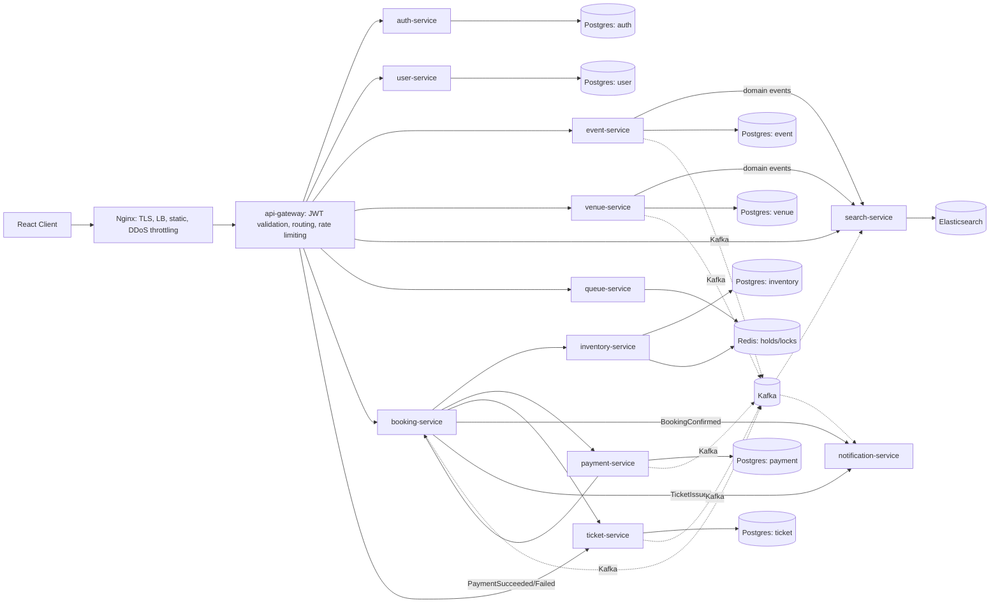

## Current Implementation

None. All 12 backend services, `frontend`, and `infra` are empty
directories — no code written yet. This page describes the **target
design** only.

**Staleness notice (2026-08-13)**: written 2026-08-05, before
`fraud-service`/`analytics-service` (ADR-003), `media-service` (ADR-017),
and every ADR from ADR-004 onward — the service count above ("12") and
the diagram below no longer match the current 16-service design, and
internal calls are still shown as generic arrows predating ADR-023's
move to gRPC. `wiki/index.md` is the current, maintained catalog; treat
this page as a historical snapshot of the earliest design pass rather
than live truth until it is regenerated. Not rewritten here for the same
reason as `final-architecture-reference.md`'s staleness notice — a
correct regeneration needs to re-derive the diagram, not patch it
piecemeal.

## Target Design

### Components

Diagram is illustrative of target shape — exact Kafka topic list, event
envelope, outbox/Debezium delivery mechanism, and DLQ design live in
[[ADR-007-kafka-event-schema]], not duplicated here.

### Data ownership (target)

| Service | Owns | Primary store |
|---|---|---|
| auth-service | credentials, roles, sessions | Postgres |
| user-service | profile, saved payment methods, preferences | Postgres |
| event-service | events, sessions/shows, artists | Postgres |
| venue-service | venues, seating layout | Postgres |
| search-service | denormalized discovery index (read-only copy) | Elasticsearch |
| inventory-service | seat state (AVAILABLE/HELD/PURCHASED) | Postgres + Redis (holds) |
| booking-service | booking orchestration state | Postgres |
| queue-service | queue admission tokens, position | Redis |
| payment-service | payment intents, transactions | Postgres |
| ticket-service | issued tickets, transfers, resale listings | Postgres |
| notification-service | delivery log (no source-of-truth domain data) | Postgres (log only) |

No service reads another service's database directly — cross-service data
access is via API call or consumed domain event, never a shared schema.

### Communication (target)

- **Synchronous REST**: client → gateway → service; booking-service →
  inventory-service (seat hold) and → payment-service (charge) where an
  immediate result is required for the user-facing flow.
- **Asynchronous (Kafka)**: side effects that don't need to block the
  triggering request — search index updates, notifications, analytics,
  audit.
- **WebSocket/SSE**: queue-service → client, for live queue position
  updates without polling.

Specific per-flow reasoning lives in `wiki/flows/`.

### Failure boundaries (target)

- notification-service outage must never block booking confirmation
  (async, at-least-once, consumer retries independently).
- search-service outage must never block event/venue writes (search is a
  read projection, not a dependency of the write path).
- payment-service and inventory-service are the two components where
  correctness under partial failure matters most — tracked as an open
  question below until a dedicated seat-locking ADR exists.

## Gap

Everything — no service implemented yet. Build order and first concrete
ADRs to write (seat locking strategy, Redis role, payment idempotency)
are tracked as open questions below.

## Open Questions

- ~~Exact Kafka topic list and schema per event~~ — resolved, see
  [[ADR-007-kafka-event-schema]].
- Build order across the 12 services — likely inventory-service first
  (hardest problem) but not yet decided/documented.
- ~~Whether api-gateway is Spring Cloud Gateway or a simpler reverse
  proxy~~ — resolved: Spring Cloud Gateway behind Nginx, see
  [[api-gateway]] / [[infra]].
- Seat locking strategy (optimistic vs pessimistic vs Redis-assisted) —
  not yet decided; needs its own ADR before inventory-service is built.
