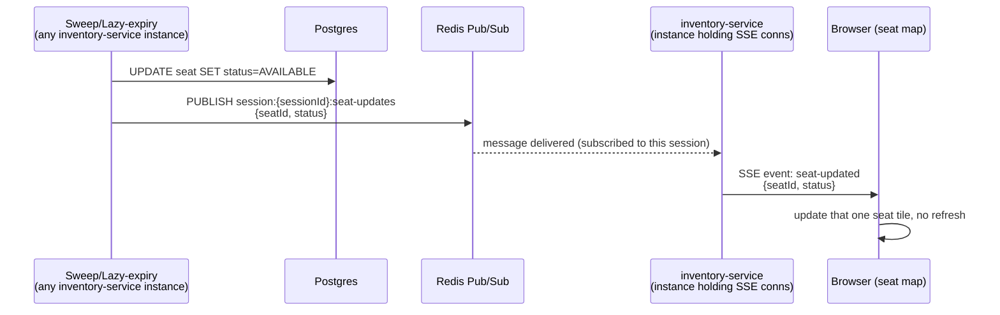

How seat status changes (a hold expiring, a seat being released) reach
every browser watching that event's seat map live, without polling.

## Entry point

Either of two triggers inside `inventory-service`, both doing the same
DB flip and firing the same downstream event:

- **Cron sweep** (~every minute): `SELECT WHERE held_until < now() FOR
  UPDATE SKIP LOCKED` — catches expired holds nobody's actively touching,
  keeps the seat map visually fresh for passive browsers.
- **Lazy expiry** (on any hold attempt): if a seat is read as `HELD` but
  `held_until` has passed, treat it as `AVAILABLE` on the spot — zero-wait
  correctness for whoever's actively trying that seat.

## Participants

`inventory-service` (multiple instances) → Redis Pub/Sub →
`inventory-service` instances holding open SSE connections → frontend
clients.

## Step-by-step

1. Whichever `inventory-service` instance flips the seat (sweep or lazy
   check) publishes to Redis Pub/Sub, channel `session:{sessionId}:seat-updates`.
2. Every `inventory-service` instance holding an open SSE connection for
   that session is subscribed to that channel — necessary because
   instances are stateless/interchangeable (per [[ADR-002-seat-locking-strategy]]),
   so the instance handling the DB write is not necessarily the one
   holding any given client's connection.
3. The instance(s) with a live connection push the event down as
   `event: seat-updated`.
4. Frontend updates just that one seat tile.

**For the specific user whose own hold expired** (likely on checkout, not
staring at the seat map): same connection, different event type —
`event: hold-expired` — triggers a "your hold expired" message instead of
a seat-tile update. Client also runs its own local countdown (from
`held_until`, returned when the hold was created) as a fallback, not
solely dependent on the push arriving.

## Data changes

Postgres: `seats.status` HELD → AVAILABLE, `held_until` cleared or left
stale (next hold attempt overwrites it). No Redis-side durable state —
Pub/Sub is fire-and-forget, not a data store.

## Transaction boundaries

The DB flip (`UPDATE ... SET status=AVAILABLE`) commits before the
publish — publish is a side effect of an already-committed fact, never
the other way around. If the publish is lost (no subscribers, network
blip), the DB state is still correct; the only cost is a client seeing
stale data until it next queries directly or a subsequent event catches
it up.

## Failure scenarios

- **No one subscribed when published**: message is simply dropped — Redis
  Pub/Sub has no replay/persistence. Acceptable: the DB is the truth, this
  is only a live-UI convenience. A client reconnecting or reloading always
  gets current state from Postgres regardless.
- **Redis Pub/Sub unavailable**: seat map stops getting live pushes, but
  booking/hold correctness is entirely unaffected (Pub/Sub is not on the
  write path at all — see [[ADR-002-seat-locking-strategy]]'s Redis role).
  Degrades to "no live updates," not "broken booking."
- **Cluster scale (future, [[ADR-004-redis-cluster-sharding]])**: use
  Redis 7+ sharded pub/sub (`SPUBLISH`/`SSUBSCRIBE`) with the same
  `{sessionId}` hash tag as the seat-lock keys, so publishes stay within
  the shard owning that session instead of broadcasting cluster-wide.

## Retry behavior / idempotency

None needed — this is a stateless notification, not a command. A missed
or duplicate `seat-updated` event has no correctness impact; the client
always converges to correct state on its next real read (page load,
reconnect, or a later event for the same seat).

## Events emitted

- `seat-updated` — `{seatId, status}`, broadcast to all clients watching
  that session's seat map.
- `hold-expired` — `{seatId}`, targeted to the specific client whose hold
  expired (same connection, filtered client-side by user context — no
  separate connection registry needed, per the Uber-registry-vs-Pub/Sub
  distinction: this rides an already-open connection rather than needing
  to look up where a disconnected user is).

## Observability requirements

Resolved — see [[ADR-015-observability-stack]]'s SSE observability section:
end-to-end push lag (Postgres commit → socket write, not just the
publish-half), publish success/failure, fanout ratio (subscribers reached
/ expected — catches a misrouted sharded-pubsub hash tag silently reaching
nobody), active connections per instance, reconnect/churn rate (a spike
means clients fell back to full Postgres reads — hidden load during an
on-sale). Deliberately not an SLO: message delivery guarantee, since
Pub/Sub is fire-and-forget by design (see Failure scenarios above).

## Connection-level admission control

Per-instance concurrent-SSE-connection cap and per-user connect-rate
limiting decided in [[ADR-022-sse-connection-admission-control]] — this
flow previously had no concurrent-connection bound, only request-rate
limits at api-gateway/Nginx, which don't constrain how many SSE streams
stay open at once.
